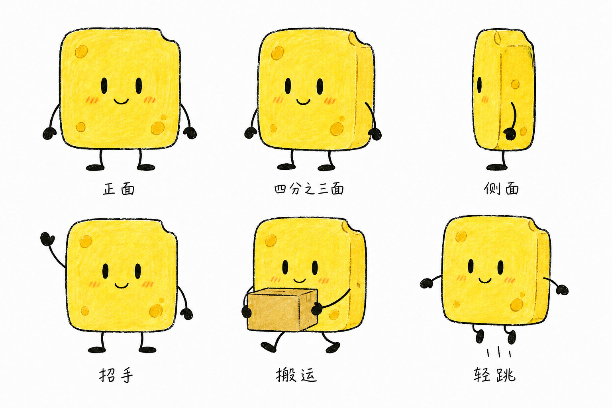
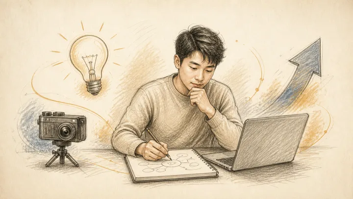
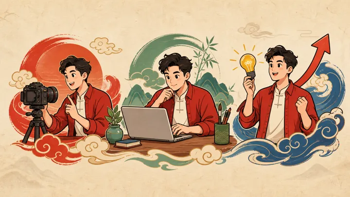
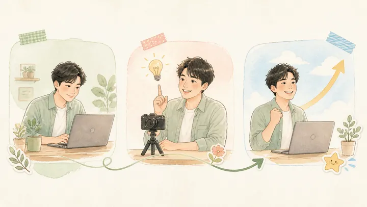
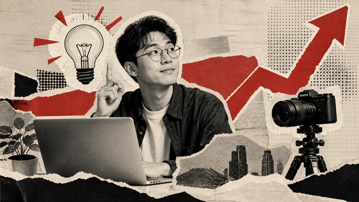
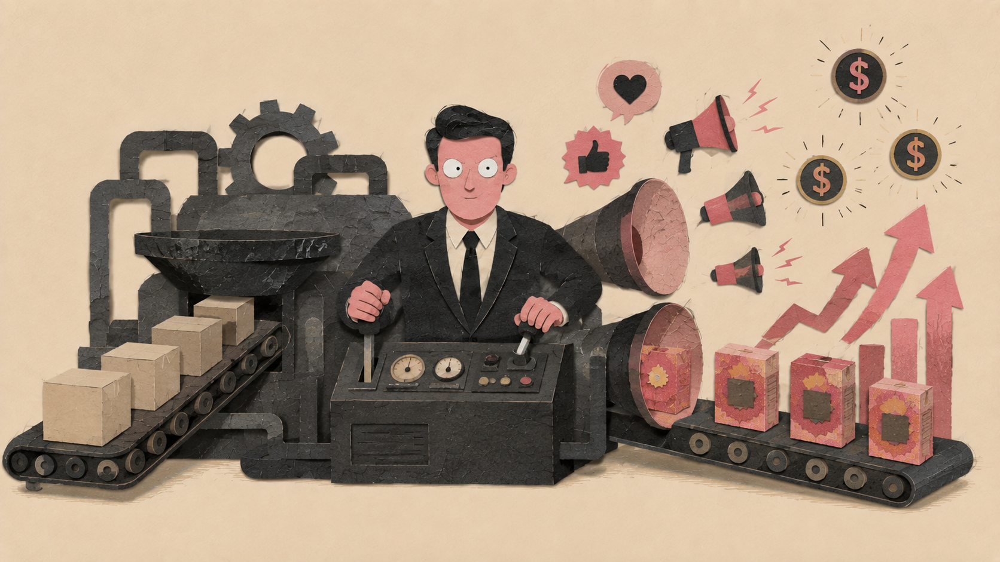

# BoomEarth 视觉模板参考手册 (Visual Template Catalog)

本手册收录并固化了 BoomEarth 渲染引擎支持的 **13 种核心视觉模板**（包含 1 套官方默认方块海绵主题与 12 套全品类视觉参考风格）。用户与编导 Agent 在选题策划、分镜生成或指定渲染风格时，可参考本手册选择最适宜的视觉方案。

所有参考预览图均已完整下载并固化在项目本地目录：`docs/assets/style-references/`。

---

## 视觉模板一览表

| 序号 | 模板名称 | 英文标识 (ID) | 预览效果 | 画面特征 | 推荐内容场景 |
| :---: | :--- | :--- | :---: | :--- | :--- |
| 1 | **方块海绵插画** *(官方默认)* | `sponge-host-handdrawn-v1` |  | 粗黑线白底、方块海绵角色、语义动作、原生手写标签、清爽留白 | BoomEarth 默认设定、AI 教程、产品讲解、知识解说 |
| 2 | **极简粗线简笔白板风** | `minimal-whiteboard` |  | 粗黑线、少量配色、清爽留白 | 知识讲解、个人表达、复盘总结 |
| 3 | **极简商务涂鸦风** | `business-doodle` |  | 几何图表、蓝绿配色、专业克制 | 产品介绍、商业分析、项目汇报 |
| 4 | **暖米黄素描白板风** | `warm-pencil` |  | 铅笔排线、纸张质感、温暖细腻 | 人物故事、个人成长、品牌叙事 |
| 5 | **粗线扁平国风卡通** | `guofeng-flat` |  | 朱红玉绿、国风纹样、生动平涂 | 传统文化、国风品牌、中文创意 |
| 6 | **爆款高热吸睛风** | `viral-pop` |  | 高饱和、强对比、夸张动势 | 短视频开场、强观点、热点表达 |
| 7 | **黑金科技发布会风** | `black-gold-tech` |  | 黑金光效、科技舞台、高级权威 | AI、科技产品、发布会 |
| 8 | **清新治愈手账风** | `healing-journal` |  | 柔和水彩、低饱和配色、生活手账感 | 情感、生活方式、自我成长 |
| 9 | **复古报纸拼贴风** | `retro-collage` |  | 撕纸拼贴、半色调、编辑杂志感 | 深度观点、文化内容、案例复盘 |
| 10 | **纸感隐喻拼贴风** | `paper-metaphor` |  | 手工剪纸、观点隐喻、高级克制 | 价值观、关系、流程、复杂观点 |
| 11 | **漫画墨线解释风** | `oil-visual` |  | 漫画墨线、半调网点、概念机制 | 原理讲解、机制拆解、商业洞察 |
| 12 | **3D黏土趣味风** | `clay-3d` |  | 黏土材质、玩具比例、温暖可爱 | 亲子教育、轻量品牌、趣味科普 |
| 13 | **赛博霓虹漫画风** | `cyber-neon` |  | 霓虹青紫、漫画速度线、未来感 | AI 趋势、数码科技、年轻化观点 |

---

## 13 种模板深度解析与工程配置

### 1. 方块海绵插画 (官方默认)
- **主题 ID**：`sponge-host-handdrawn-v1`
- **调用指令**：`这条视频使用方块海绵插画风格。`
- **画面特征**：纯白底色、松弛粗黑手绘线、暖黄色圆角方块海绵主持人角色、与文案紧密相关的真实动作、原生手写中文标签。
- **默认进场动效**：`scale-settle`（轻度缩放卡位）
- **核心质检项 (QC)**：海绵形象一致性 (`sponge_identity_consistent`)、角色参与语义动作 (`character_performs_action`)、原生中文标签无误 (`native_labels_correct`)、纯白画布 (`white_canvas`)。

### 2. 极简粗线简笔白板风
- **主题 ID**：`minimal-whiteboard`
- **调用指令**：`这条视频使用极简粗线简笔白板风，以粗黑线、少量配色和清爽留白进行图解。`
- **画面特征**：高对比粗黑线条、克制的单色/双色点缀、大面积呼吸感留白，结构简明利落。
- **默认进场动效**：`line-reveal`（线条勾勒呈现）
- **推荐场景**：知识脉络梳理、观点表达、方法论复盘与经验总结。

### 3. 极简商务涂鸦风
- **主题 ID**：`business-doodle`
- **调用指令**：`这条视频使用极简商务涂鸦风，用几何图表与蓝绿配色做专业克制的视觉呈现。`
- **画面特征**：清晰严谨的几何图表、蓝灰绿克制商务色盘、手绘涂鸦亲和力与商业逻辑兼备。
- **默认进场动效**：`line-reveal`（图表路径浮现）
- **推荐场景**：B端产品介绍、商业模式分析、企业战略及项目汇报。

### 4. 暖米黄素描白板风
- **主题 ID**：`warm-pencil`
- **调用指令**：`这条视频使用暖米黄素描白板风，通过铅笔排线与米黄纸张质感呈现温暖细腻的图景。`
- **画面特征**：暖色米黄纸张底纹、细腻铅笔排线阴影、温暖沉静的人文氛围。
- **默认进场动效**：`fade-up`（自下而上柔和显现）
- **推荐场景**：人物访谈、个人成长历程、品牌初心故事。

### 5. 粗线扁平国风卡通
- **主题 ID**：`guofeng-flat`
- **调用指令**：`这条视频使用粗线扁平国风卡通风格，融合朱红玉绿、国风纹样与生动平涂。`
- **画面特征**：传统国风色彩（朱砂红、黛蓝、玉色）、经典纹样与现代粗线扁平插画相得益彰。
- **默认进场动效**：`scale-settle`（稳重卡入）
- **推荐场景**：中华传统文化、新国潮品牌、节气民俗与东方美学创意。

### 6. 爆款高热吸睛风
- **主题 ID**：`viral-pop`
- **调用指令**：`这条视频使用爆款高热吸睛风，以高饱和、强对比与夸张动势抓住眼球。`
- **画面特征**：高饱和亮黄/亮蓝、醒目爆破发散线、强情绪张力人物姿态，冲击力十足。
- **默认进场动效**：`scale-settle`（强动势冲击定格）
- **推荐场景**：爆款短视频开场、犀利观点交锋、社会热点聚焦。

### 7. 黑金科技发布会风
- **主题 ID**：`black-gold-tech`
- **调用指令**：`这条视频使用黑金科技发布会风，以黑金光效、科技舞台与高级权威感展示内容。`
- **画面特征**：深沉黑底配璀璨金光/冷光、Keynote 级舞台光影、克制而高级的工业质感。
- **默认进场动效**：`fade-up`（光影升起）
- **推荐场景**：AI 前沿成果、高端硬件/数码发布会、重磅战略发布。

### 8. 清新治愈手账风
- **主题 ID**：`healing-journal`
- **调用指令**：`这条视频使用清新治愈手账风，用柔和水彩、低饱和配色与生活手账感传递温度。`
- **画面特征**：低饱和度马卡龙/莫兰迪配色、透明水彩晕染边、生活手账小插画细节。
- **默认进场动效**：`fade-up`（舒缓显现）
- **推荐场景**：情感抚慰、慢生活美学、自我心理疗愈与书籍分享。

### 9. 复古报纸拼贴风
- **主题 ID**：`retro-collage`
- **调用指令**：`这条视频使用复古报纸拼贴风，通过撕纸拼贴、半色调与编辑杂志感做深度呈现。`
- **画面特征**：旧报纸撕纸边缘、黑白波点半色调 (Halftone)、杂志封面式混搭排版。
- **默认进场动效**：`scale-settle`（剪贴定格）
- **推荐场景**：深度调查报道、文化历史回顾、复杂商业案例拆解。

### 10. 纸感隐喻拼贴风
- **主题 ID**：`paper-metaphor`
- **调用指令**：`这条视频使用纸感隐喻拼贴风，用手工剪纸与观点隐喻呈现高级克制的视觉。`
- **画面特征**：立体剪纸层次阴影、几何色块重叠、富有哲理与象征意义的观点隐喻。
- **默认进场动效**：`wipe-right`（剪纸横向展开）
- **推荐场景**：抽象哲学思考、复杂人际关系与系统流程隐喻。

### 11. 漫画墨线解释风
- **主题 ID**：`oil-visual`
- **调用指令**：`这条视频使用漫画墨线解释风，以漫画墨线、半调网点和概念机制清晰拆解原理。`
- **画面特征**：日美漫式钢笔硬墨线、机械透视排线、经典半调网点与动态分镜张力。
- **默认进场动效**：`line-reveal`（墨线勾勒呈现）
- **推荐场景**：底层原理讲解、技术机制拆解、硬核商业逻辑洞察。

### 12. 3D黏土趣味风
- **主题 ID**：`clay-3d`
- **调用指令**：`这条视频使用3D黏土趣味风，以黏土材质、玩具比例和温暖可爱的质感呈现。`
- **画面特征**：软萌黏土捏制质感、玩具身材比例、温暖柔和的环境顶光与定格动画感。
- **默认进场动效**：`scale-settle`（软萌弹性落定）
- **推荐场景**：亲子少儿教育、轻松幽默科普、轻量化生活品牌宣传。

### 13. 赛博霓虹漫画风
- **主题 ID**：`cyber-neon`
- **调用指令**：`这条视频使用赛博霓虹漫画风，以霓虹青紫、漫画速度线和未来感突出科技张力。`
- **画面特征**：青蓝 (Cyan) 与洋红 (Magenta) 霓虹发光光晕、极速透视速度线、赛博科幻感。
- **默认进场动效**：`wipe-right`（霓虹光扫呈现）
- **推荐场景**：Web3/元宇宙、数码极客潮流、年轻世代先锋观点。

---

## 如何在项目中指定模板

### 方式一：在交接文档中指定（Handoff）
在项目的 `工程/2026-xx-xx-xxx/交接.md`（或 Content Plan Candidate）前置元数据中声明：
```yaml
---
status: 制作中
visual: "black-gold-tech"  # 填入上述 13 种模板 ID 之一
---
```

### 方式二：Python 渲染管线调用
```python
from boomearth.video.illustration_themes import resolve_visual_style

# 解析选定模板
style = resolve_visual_style("clay-3d")
print(style.visual_theme)       # 'clay-3d'
print(style.visual_system)      # 'profiled-illustration-v4'
print(style.illustration_skill) # 'ra-video-illustrations'
```
