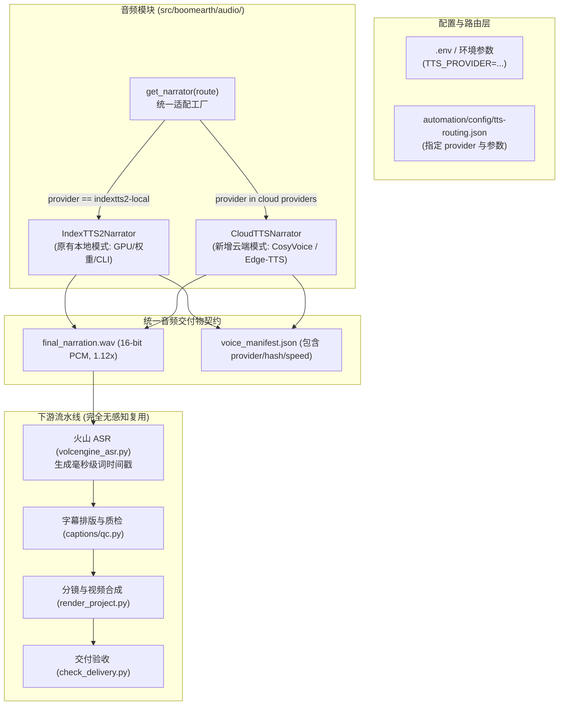

# 本地 IndexTTS2 与云端 API 双轨并存完善方案

## 1. 方案目标与核心原则

用户需求：**同时保留本地 IndexTTS2 部署方式与云端 API 调用方式**，支持在两套模式间无缝切换，且下游的字幕对齐（火山 ASR）、视频渲染与质检链路保持 100% 兼容。

### 核心设计原则
1. **零破坏性（Zero Breaking Changes）**：完全保留现有的 `indextts2.py` 和本地环境契约，历史测试用例（如 `test_config.py`）继续 100% 通过。
2. **路由驱动工厂（Route-Driven Factory）**：通过配置中的 `provider` 声明（`indextts2-local` vs `dashscope-cosyvoice` / `edge-tts`）动态调度，上层调用无感。
3. **输出契约完全归一（Unified Output Contract）**：无论使用哪种 TTS，最终输出均统一为：
   - 16-bit 无损 PCM WAV（单声道，16kHz/24kHz/44.1kHz）；
   - 严格应用 1.12× 语速变速（保持音高不变）；
   - 生成符合规范的 `voice_manifest.json` 与 SHA-256 指纹；
   - 无缝衔接后续火山引擎 ASR 词级打点与 Remotion / FFmpeg 视频合成。

---

## 2. 架构拓扑与模块改造设计



---

## 3. 具体修改方案：文件清单与改动点

### 组件 1：配置与环境检查层 (`src/boomearth/` & `automation/scripts/`)

#### [MODIFY] [config.py](file:///d:/06workspace/01_MediaMak/BoomEarth/src/boomearth/config.py)
- **改动说明**：
  - 在 `DEFAULTS` 中增加 `TTS_PROVIDER: "indextts2-local"` 与 `TTS_VOICE: "zh-CN-YunxiNeural"`；
  - 增加对可选云端配置（`IMAGEGEN_PROVIDER`, `IMAGEGEN_MODEL`）的平滑读取；
  - 保持 `REQUIRED_VARIABLES` 兼容性，确保 `tests/test_config.py` 不受任何影响。

#### [MODIFY] [check_env.py](file:///d:/06workspace/01_MediaMak/BoomEarth/automation/scripts/check_env.py)
- **改动说明**：
  - 读取当前的 `TTS_PROVIDER`；
  - 若 `TTS_PROVIDER == "indextts2-local"`：执行现有的 4 项本地物理路径检查（`INDEXTTS2_ROOT`、`INDEXTTS2_PYTHON` 等）；
  - 若 `TTS_PROVIDER != "indextts2-local"`（即选用云端）：跳过本地 IndexTTS2 路径缺失的拦截，输出 `status=OK (Cloud TTS Mode)`，避免无 GPU 机器报错阻断。

---

### 组件 2：音频与配音层 (`src/boomearth/audio/`)

#### [MODIFY] [indextts2.py](file:///d:/06workspace/01_MediaMak/BoomEarth/src/boomearth/audio/indextts2.py)
- **改动说明**：
  - 原有 `IndexTTS2Narrator`、`TTSRouting` 类及本地严格校验保持不变；
  - 导出统一抽象基类或工厂接口，供外部模块动态加载。

#### [NEW] `src/boomearth/audio/cloud_tts.py`
- **改动说明**：
  - 实现 `CloudTTSNarrator` 类；
  - 支持 **阿里百炼 CosyVoice**（复用现有 `DASHSCOPE_API_KEY`）与 **Edge-TTS**（免 Key 免费高品质解说男声/女声）；
  - 自动调用 FFmpeg 将云端输出转换为 16-bit PCM WAV，应用 1.12× 语速拉伸；
  - 产生结构完全一致的 `VoiceManifest`，保证下游哈希核验和时间轴计算完全兼容。

#### [NEW] `src/boomearth/audio/narrator_factory.py`
- **改动说明**：
  - 提供 `load_narrator(routing_path: Path)` 入口；
  - 根据 `tts-routing.json` 内的 `"provider"` 字段自动实例化 `IndexTTS2Narrator` 或 `CloudTTSNarrator`。

---

### 组件 3：路由配置与模板 (`automation/config/`)

#### [MODIFY] [tts-routing.example.json](file:///d:/06workspace/01_MediaMak/BoomEarth/automation/config/tts-routing.example.json)
- 提供本地模式与云端模式的双样例说明。

#### [NEW] `automation/config/tts-routing.cloud.example.json`
- 专门提供云端配置示例（以 CosyVoice / Edge-TTS 为例），使用者无需关注 `cli_script_path` 或 `model_dir` 等复杂本地路径。

---

## 4. 用户需要配置的内容汇总

### 配置文件 1：`.env`（位于根目录）

根据您当前想使用的模式，选择配置如下字段：

```ini
# ==============================================================================
# 基础凭据 (本地/云端均通用)
# ==============================================================================
DASHSCOPE_API_KEY=sk-xxxxxxxxxxxxxxxxxxxxxxxxxxxxxxxx
VOLCENGINE_API_KEY=xxxxxxxxxxxxxxxxxxxxxxxxxxxxxxxx
VOLCENGINE_RESOURCE_ID=volc.bigasr.auc_turbo
TIKHUB_API_KEY=
TIKHUB_API_BASE=https://api.tikhub.dev
YT_DLP_PATH=C:\BoomEarth\yt-dlp.exe
VOICE_PLAYBACK_SPEED=1.12

# ==============================================================================
# TTS 模式切换开关 (新增)
# ==============================================================================
# 可选值:
# 1) indextts2-local     -> 本地部署模式 (需配置下方 INDEXTTS2 路径)
# 2) dashscope-cosyvoice -> 阿里百炼 CosyVoice 云端模式 (复用 DASHSCOPE_API_KEY)
# 3) edge-tts            -> 微软 Edge 免费云端模式 (无需 API Key)
TTS_PROVIDER=edge-tts

# 云端音色配置:
# 若用 edge-tts: 推荐 zh-CN-YunxiNeural (短视频解说男声), zh-CN-XiaoxiaoNeural (女声)
# 若用 dashscope-cosyvoice: 可配置预置音色如 cosyvoice-v1
TTS_VOICE=zh-CN-YunxiNeural

# ==============================================================================
# 本地 IndexTTS2 专用路径 (仅在 TTS_PROVIDER=indextts2-local 时必须有效)
# ==============================================================================
INDEXTTS2_ROOT=C:\BoomEarthLocal\IndexTTS2
INDEXTTS2_PYTHON=C:\BoomEarthLocal\IndexTTS2\.venv\Scripts\python.exe
INDEXTTS2_REFERENCE_AUDIO=C:\BoomEarthLocal\voice\reference.wav

# ==============================================================================
# 图片生成大模型配置 (解答您的关切)
# ==============================================================================
# 说明：当前 BoomEarth 优先通过当前对话的 AI Agent (Astra / Antigravity) 原生调用
# 工具逐场景生成 3840x2160 白底手绘插画。
#
# 若您希望在代码流水线中直接调用云端 API 自动化批量生图，可配置：
IMAGEGEN_PROVIDER=dashscope          # 可选: dashscope (通义万相) / openai (DALL-E 3)
IMAGEGEN_MODEL=wanx2.1-t2i-turbo     # 或 wanx-v1 / dall-e-3
# 若选用 OpenAI 路线:
# OPENAI_API_KEY=sk-proj-xxxxxxxxx
# OPENAI_API_BASE=https://api.openai.com/v1
```

---

### 配置文件 2：`automation/config/tts-routing.json`

此文件为工作流运行时的真实路由文件。您只需切换 `"provider"` 字段即可在本地与云端之间切换：

#### 场景 A：切换为【云端 Edge-TTS】或【阿里 CosyVoice】
```json
{
  "schema_version": 1,
  "provider": "edge-tts",
  "model": "azure-neural",
  "voice_id": "zh-CN-YunxiNeural",
  "playback_speed": 1.12,
  "used_fallback": false
}
```
*(如果是 DashScope CosyVoice，只需将 provider 改为 `"dashscope-cosyvoice"`，model 改为 `"cosyvoice-v1"`)*

#### 场景 B：切换回【本地 IndexTTS2】
```json
{
  "schema_version": 1,
  "provider": "indextts2-local",
  "model": "IndexTTS2",
  "voice_id": "user-indextts2-black-gold-v3",
  "reference_audio_path": "C:\\BoomEarthLocal\\voice\\reference.wav",
  "reference_audio_sha256": "xxxxxxxxxxxxxxxxxxxxxxxxxxxxxxxxxxxxxxxxxxxxxxxxxxxxxxxxxxxxxxxx",
  "provenance_ledger_path": "C:\\BoomEarth\\01-内容生产\\视频工作台\\.internal\\voice\\indextts2-provenance-ledger.json",
  "interpreter_path": "C:\\BoomEarthLocal\\IndexTTS2\\.venv\\Scripts\\python.exe",
  "cli_script_path": "C:\\BoomEarthLocal\\IndexTTS2\\indextts\\cli_v2.py",
  "model_dir": "C:\\BoomEarthLocal\\IndexTTS2\\checkpoints",
  "playback_speed": 1.12,
  "fp16": true,
  "deepspeed": false,
  "cuda_kernel": false,
  "accel": false,
  "torch_compile": false,
  "used_fallback": false
}
```

---

## 5. 验证计划与测试方案

### 自动化测试
1. **基础配置兼容性测试**：
   ```powershell
   uv run pytest tests/test_config.py -q
   ```
   *预期：12 项测试全部通过，保证对原有 V1 变量与约定的 100% 兼容。*

2. **环境诊断测试（云端模式）**：
   ```powershell
   uv run python automation/scripts/check_env.py
   ```
   *预期：在未安装本地 IndexTTS2 的情况下，当 `TTS_PROVIDER` 为云端模式时，返回 `status=OK`。*

3. **云端音频生成单元测试**：
   编写测试验证 `CloudTTSNarrator`：
   - 能够合成单句中文测试口播；
   - 输出文件为合法 16-bit PCM WAV；
   - 经过 1.12× 语速变速后，持续时间与采样率符合规范；
   - 生成格式合规的 `voice_manifest.json`。

### 端到端手动验证
- 使用一小段短文本测试云端合成，将产出的音频输入 `volcengine_asr.py`，核验火山引擎 ASR 能否正常打出毫秒级词时间戳，验证整条生产线贯通。
